<p align="center">
  
</p>

<h1 align="center">Magic Import</h1>

<p align="center"><b>Turn any spreadsheet into the data shape your system expects.</b></p>

<p align="center">
  <a href="https://github.com/VsevaTech/magic-import/actions/workflows/ci.yml"></a>
  
  
  
</p>

Upload messy customer CSV/XLSX files, map them to your schema, clean and validate the data,
fix problems, and export an import-ready dataset — without opening Excel.

```text
Messy Spreadsheet
       ↓
   Magic Import
       ↓
  Auto Mapping            Client → customer_name        HIGH
       ↓                  E-mail Address → email        HIGH
Transform & Validate      Mobile No. → phone            HIGH
       ↓                  "Israel" / "IL" / "ISR" → IL
 Review Problems          050-123-4567 → +972501234567
       ↓                  21/09/2026 → 2026-09-21
Clean Import-Ready Data
```

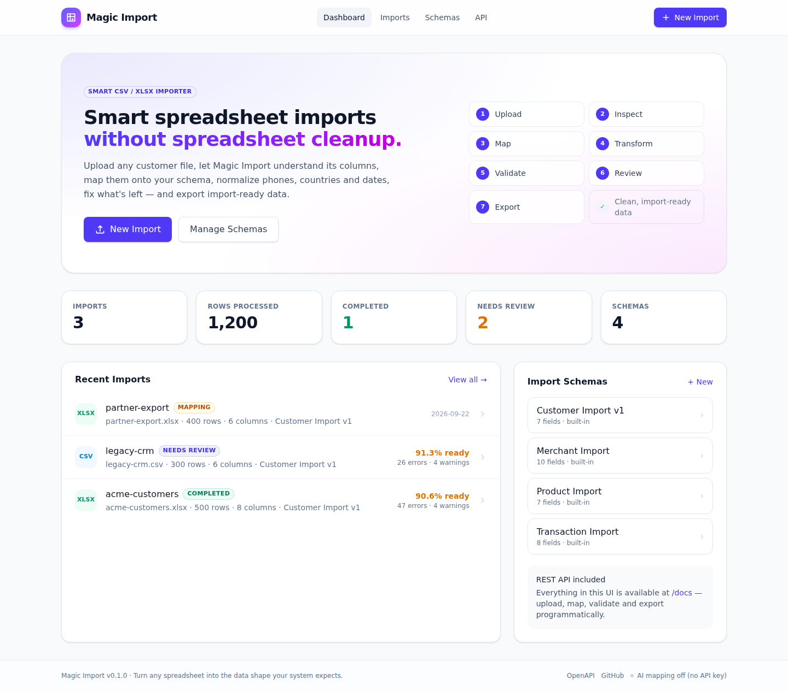

---

## Why

Every B2B SaaS imports customers, merchants, products, transactions, terminals, employees…
Your system expects `customer_name, email, phone, company, country`. One client sends
`Client, E-mail Address, Mobile No., Organization, Country Name`, the next one
`Full Name, Mail, Telephone, Business, Location`, the third `customer, email_address,
phone_number, company_name, country_code`. Every time somebody massages the file by hand.

Magic Import replaces that with a repeatable workflow:

```text
Upload → Understand → Map → Validate → Clean → Preview → Import / Export
```

It is not a CSV converter and not just a column mapper — it covers the whole import
workflow: file analysis, mapping suggestions, data-quality analysis, transformations,
validation, error resolution and a normalized dataset at the end.

## Features

| | |
|---|---|
| **Upload** | Drag & drop CSV / XLSX up to 20 MB. Delimiter (`,` `;` `\t` `\|`) and encoding (UTF-8, UTF-8-BOM, Windows-1252, fallback) detected automatically. Multi-sheet workbooks let you pick the sheet. Formulas and macros are never evaluated. |
| **Inspect** | Per-column profile: probable type, empty %, unique %, sample values, empty / duplicate headers. |
| **Auto mapping** | Deterministic levels — saved mapping → exact → normalized → aliases → fuzzy (RapidFuzz) → type hint — then, optionally, Gemini for what is still ambiguous. Confidence is categorical: `HIGH / MEDIUM / LOW / UNMAPPED`, never a fake `93.71 %`. |
| **Manual mapping** | Change any target, ignore columns, conflict detection when a target is mapped twice. |
| **Mapping templates & memory** | Save a mapping as *"Acme CRM Customer Export"*; the next file with the same headers gets *Template detected → Apply*. Confirmed pairs are remembered per schema. |
| **Transformations** | Trim, empty-token normalization (`N/A`, `null`, `-`), case, dates (many formats → ISO 8601, ambiguous day/month flagged, column-level order inference), booleans, exact `Decimal` numbers, phones (E.164 via `phonenumbers`, country used as context), countries (ISO 3166-1, incl. Hebrew/Arabic/Cyrillic names), currencies (ISO 4217, `$` flagged as ambiguous), emails (trim + lowercase domain, never "auto-fixed"), URLs, split / combine columns, defaults, replace. |
| **Validation** | required, unique, type, min/max length, regex, enum, numeric range, date range + small declarative cross-field rules (`if country == IL then phone must be an IL number`, `end_date >= start_date`). Issues are `ERROR / WARNING / INFO`. |
| **Data-quality dashboard** | Ready / warnings / errors, import-ready %, top issues, suggested bulk fixes. |
| **Interactive review table** | Highlighted cells, click for original vs normalized + the problem, inline editing with instant row revalidation, bulk fixes (*Normalize "Isreal" → "IL" for 7 rows*), undo, reset column, Original/Normalized toggle, filters by status / column / issue type, search. |
| **Export** | CSV / XLSX (sheet `Data` + sheet `Import Report`) / JSON with target field names; *ready rows only / all / error rows only*; `errors.csv` with an `_issues` column; `import-report.json`. Formula injection protection built in. |
| **Import history** | Every job keeps schema, mapping, transformations, summary and issues. Raw uploads are deleted after parsing. |
| **Schema Builder** | Create your own target contracts: 12 field types, required / unique, aliases, defaults, validation rules, cross-field rules. |
| **Schema from OpenAPI** | Load an OpenAPI 3.x / Swagger 2.0 / JSON Schema document, pick a request body such as `POST /v1/merchants` and get the Import Schema for it: `$ref`, `allOf` / `oneOf`, nullable, enums, formats and constraints are translated; nested objects are flattened and rebuilt on export. |
| **API payloads + contract check** | For contract-built schemas, export the rows as the nested, typed request bodies and validate every payload against the contract (JSON Schema 2020-12) before anything is sent. |
| **REST API + OpenAPI** | Everything the UI does is available under `/api/v1`, documented at `/docs`, with one error contract. |

## Screenshots

| Upload | Inspect |
|---|---|
| 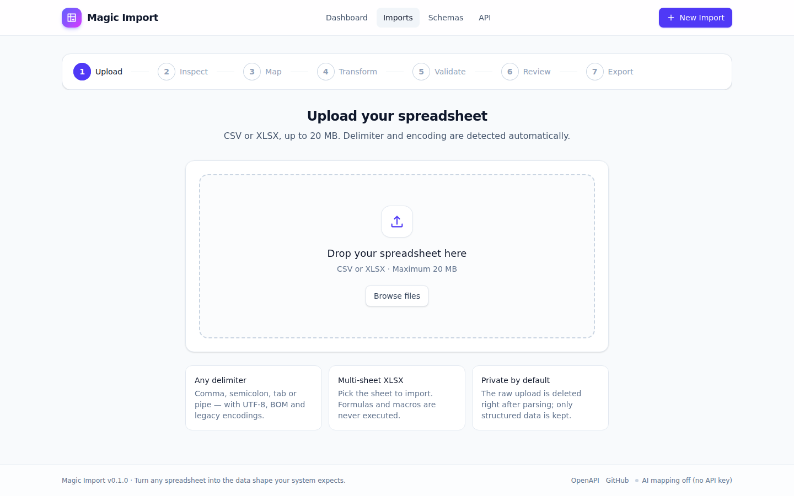 | 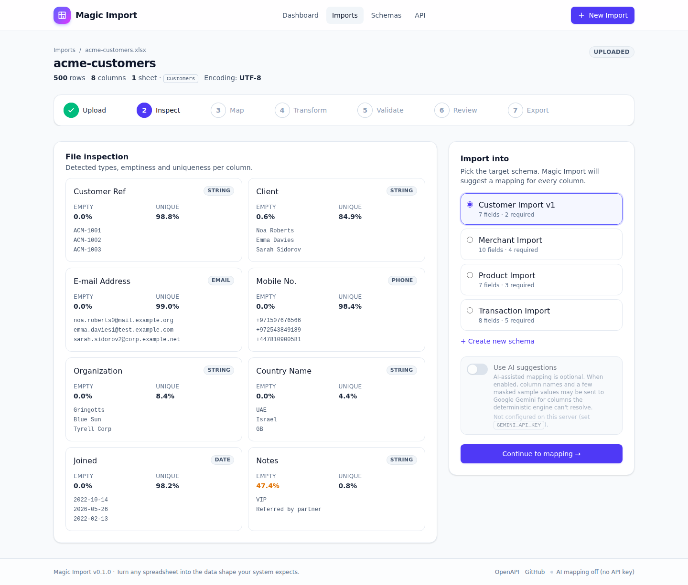 |

| Mapping (acme-customers.xlsx) | Same schema, different headers (legacy-crm.csv) |
|---|---|
| 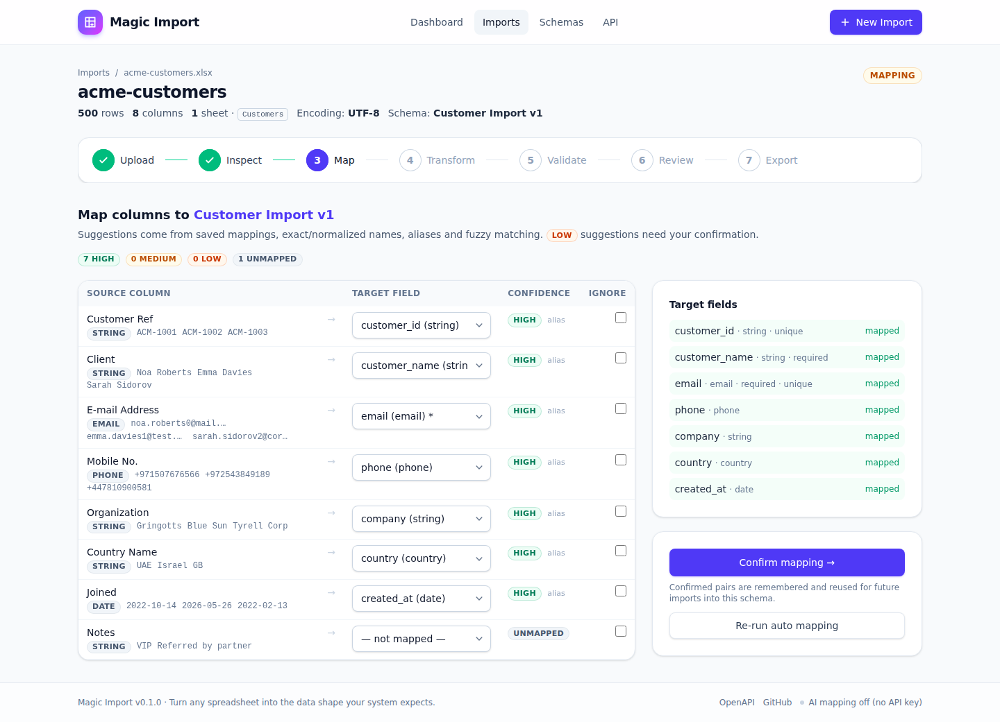 | 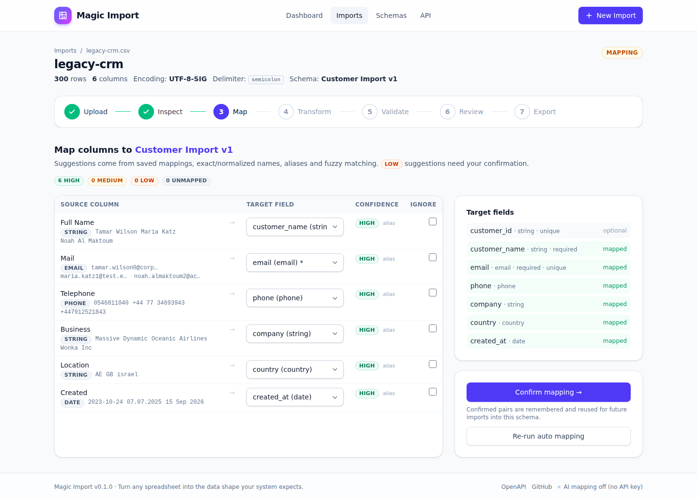 |

| Transformations | Data quality |
|---|---|
| 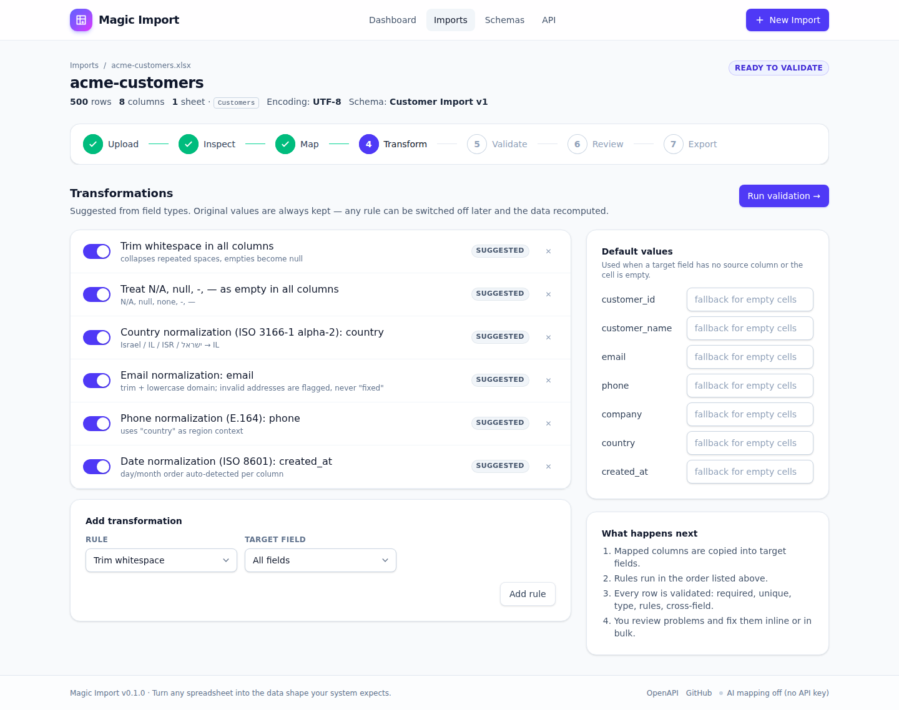 | 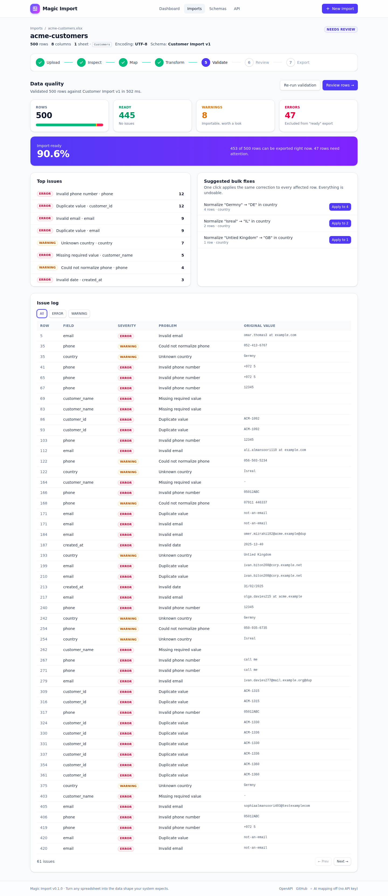 |

| Interactive review | Cell details |
|---|---|
| 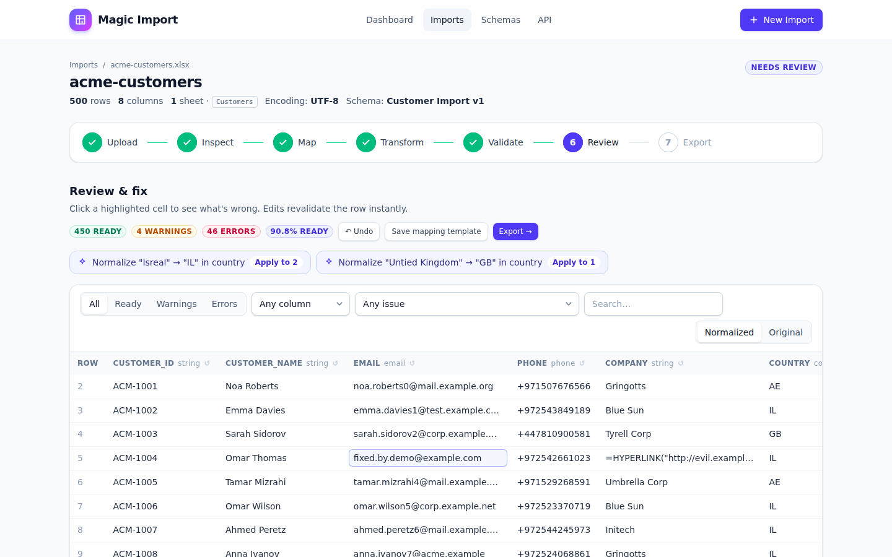 | 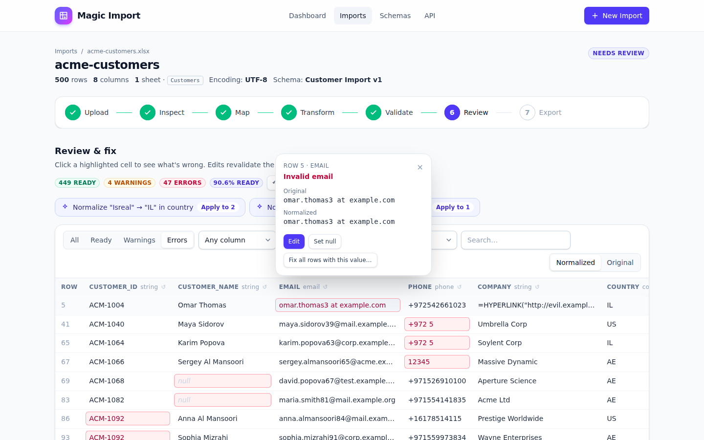 |

| Export | Schema Builder |
|---|---|
| 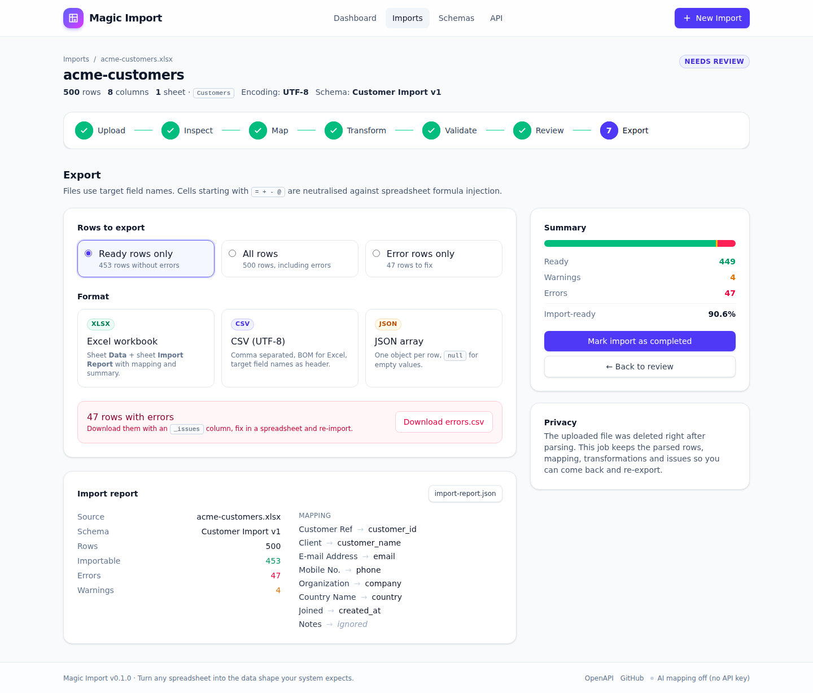 | 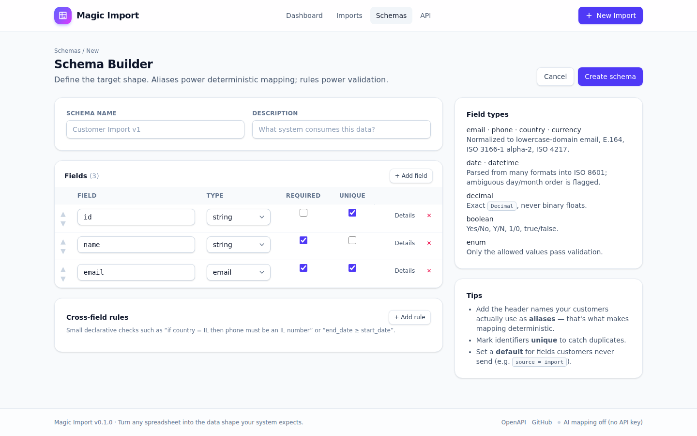 |

| OpenAPI: pick a request body | OpenAPI: generated fields |
|---|---|
|  |  |

| Excel mapped onto the contract | Payloads checked against the contract |
|---|---|
|  |  |

<details><summary>Mobile layout</summary>

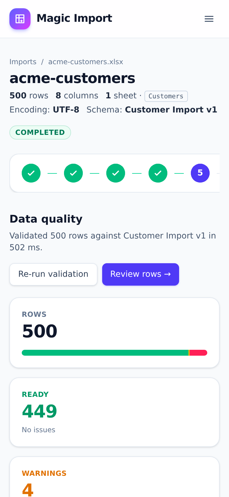

</details>

Screenshots are real: they are taken by [`scripts/browser_demo.py`](scripts/browser_demo.py),
a Playwright walk-through of the whole flow that also runs in CI.

## Quick start

```bash
docker compose up --build
# → http://localhost:8000        UI
# → http://localhost:8000/docs   OpenAPI
```

Without Docker:

```bash
python -m venv .venv && source .venv/bin/activate
pip install -e ".[dev]"
uvicorn app.main:app --reload
```

Optional configuration lives in [`.env.example`](.env.example). Everything works with no
configuration at all; SQLite and temporary uploads live in `./data` (a Docker volume in compose).

## Demo

`demo-data/` contains three files with completely different headers that all import into the
built-in **Customer Import v1** schema. They are generated deterministically by
[`demo-data/generate_demo_data.py`](demo-data/generate_demo_data.py) and deliberately dirty:
invalid emails, duplicate IDs and emails, empty required names, four phone formats,
`Israel / IL / ISR / israel`, five date formats, whitespace, `N/A / null / -`, a spelled-wrong
country and a spreadsheet-formula payload.

| File | Headers | Rows | Result |
|---|---|---|---|
| `acme-customers.xlsx` | Customer Ref, Client, E-mail Address, Mobile No., Organization, Country Name, Joined, Notes | 500 | 445 ready · 8 warnings · 47 errors |
| `legacy-crm.csv` (`;`, UTF-8-BOM) | Full Name, Mail, Telephone, Business, Location, Created | 300 | 270 ready · 4 warnings · 26 errors |
| `partner-export.xlsx` (2 sheets) | customer, email_address, phone_number, company_name, country_code, created_at | 400 | 382 ready · 0 warnings · 18 errors |

The walkthrough:

1. `docker compose up --build`, open the app, **New Import**, drop `acme-customers.xlsx`.
2. Inspect the profile, choose **Customer Import v1**.
3. Every column is mapped `HIGH` (`Client → customer_name`, `Mobile No. → phone`, …), `Notes` stays unmapped. Confirm.
4. Transformations are proposed from the field types: trim, empty tokens, country, phone (using the country as region context), date, email. Run validation.
5. Data quality: `500 rows · 445 ready · 8 warnings · 47 errors · 90.6 % import-ready`, top issues, bulk fixes.
6. Apply *Normalize "Isreal" → "IL"*, fix one invalid email inline, undo, save the mapping as a template.
7. Export **Ready rows → XLSX**, download `errors.csv` for the 47 problem rows.
8. Drop `legacy-crm.csv` — totally different column names land on the same schema, again all `HIGH`.

The exact issue counts are asserted in [`tests/test_demo_data.py`](tests/test_demo_data.py).

The API-contract demo uses two more files:

| File | What it is |
|---|---|
| `merchant-api.yaml` | OpenAPI 3.1 of a fictional payments API: `POST /v1/merchants` (via `components/requestBodies`, `allOf`, nested `address`, `readOnly id`, `owners[]`, nullable, enums, defaults, `x-aliases`), a `PATCH` with `merge-patch+json`, a multipart upload and `POST /v1/terminals`. |
| `merchant-onboarding.xlsx` | 120 merchants with spreadsheet headers (`Merchant Ref`, `Legal Name`, `Street`, `City`, `Postcode`, `Settlement Currency`, …): 100 ready · 4 warnings · 16 errors; all 104 importable rows pass the contract check. |

9. **Schemas → Import from OpenAPI → Use sample**, pick `POST /v1/merchants`, review the 18 generated fields (`id` and `owners` are skipped with a reason), **Create schema**.
10. Import `merchant-onboarding.xlsx` into it — all 17 columns map `HIGH` (`Street → address_line1`, `City → address_city`).
11. Export → **Check against contract**: *All 104 payloads match POST /v1/merchants*; download `payloads.json`.

## Import schemas & Schema Builder

A schema is the target data contract. Each field has `name, display_name, type, required,
unique, description, aliases, example, default, rules` and an `allow_multiple_sources` flag.

Types: `string · integer · decimal · boolean · email · phone · date · datetime · country ·
currency · url · enum`. Decimals are parsed with `decimal.Decimal`, never binary floats.

Aliases drive deterministic matching: `email` with aliases `mail, e-mail, email address,
contact email` maps `E-mail Address` without any fuzzy logic or AI.

Four schemas ship built in: **Customer Import v1**, **Merchant Import**, **Product Import**,
**Transaction Import**. Create your own in the UI (`/schemas/new`) or via `POST /api/v1/schemas`.

## Schema from an API contract

Most target systems already have their contract written down: the OpenAPI of the endpoint the
data will be sent to. Instead of re-typing it in the Schema Builder, load the document and pick
the request body.

```text
openapi.yaml ─► inspect ─► POST /v1/merchants ─► preview (fields · skipped · warnings) ─► schema
                                                                                        │
Excel ─► map ─► transform ─► validate ─► payloads.json  ◄── contract check (JSON Schema) ┘
```

**What is translated**

| Contract | Import Schema |
|---|---|
| `type: string` + `format: email / uri / date / date-time` | `email / url / date / datetime` |
| `type: integer`, `type: number` | `integer`, `decimal` (never a float) |
| `type: boolean` | `boolean` |
| `enum`, `const` | `enum` with the allowed values |
| string restricted to 2 / 3 letters on a `*country*` / `*currency*` property | `country` / `currency` (reported as *type inferred*) |
| `minLength / maxLength / pattern / minimum / maximum / exclusive*` | rules; JSON Schema's "contains" patterns become full-match regexes |
| `required` (all the way up), `default`, `example`, `description`, `title` | required, default, example, description, display name |
| nested objects | flattened fields (`address.city` → `address_city`) with the JSON path kept |
| `x-aliases`, `x-unique` | aliases (deterministic mapping), unique |
| `$ref` (local), `allOf`, `oneOf` / `anyOf` (object variants merged, `null` variant = nullable), OAS 3.0 `nullable`, 3.1 type lists | resolved before mapping |

**What is skipped — and said so** (never guessed): `readOnly` properties, arrays of objects (one
row is one request — import the items as another file), free-form maps, binary uploads, recursive
and external `$ref`. Lists of scalars (`tags: [..]`) are one cell with `;`- or `,`-separated values.

**Payloads.** The schema keeps the dereferenced request body as its *contract*. On export
(`format=payload`) each row becomes the nested body with real JSON types — integers, exact
decimals written from `Decimal`, booleans, lists, `null` for required nullable properties —
and `GET /imports/{id}/contract-check` validates every payload against the contract, returning
the spreadsheet row, JSON path and failing keyword for each problem. This check found two
things the per-field validation alone would have let through, both fixed for every schema:
enum values keep the source casing (`Medium` is now written as the allowed `medium`), and a
value that could not be normalized (warning) now still has to satisfy explicit rules such as a
pattern.

Nothing is fetched from the network: only local `#/…` references are resolved, YAML is read with
the safe loader, documents are limited to 2 MB.

## Mapping engine

```text
priority   level          example                          confidence
   1       saved mapping  "Mobile No." → phone (remembered)   HIGH
   2       exact          email → email                       HIGH
   3       normalized     E-mail Address → email_address      HIGH
   4       alias          Mobile No. → phone                  HIGH
   5       fuzzy          Customer Nme → customer_name        MEDIUM / LOW
   6       type hint      a column full of emails → email     LOW
   7       AI (optional)  Cust Mail Addr → email              MEDIUM / LOW
   —       nothing fits   Notes → —                           UNMAPPED
```

`LOW` suggestions must be confirmed. Mapping the same target from two columns is a conflict
(`invalid_mapping`) unless the field allows multiple sources.

## Transformations & validation

Original values are never mutated: every run starts from the parsed rows, so a transformation
can be switched off and the dataset recomputed. Manual edits are stored as overrides and
applied *before* the field rules run, so fixing a country also fixes the phone-region context.

Normalizers never turn a doubtful value into a valid one silently: `03/04/2026` is parsed
day-first **and** flagged `date_ambiguous` (unless the column proves the order),
`1,299` is `decimal_ambiguous`, `$` is `currency_ambiguous`, an unparseable phone stays as
typed with a warning.

Cross-field rules are small declarative objects on the schema:

```json
{"when": {"field": "country", "op": "eq", "value": "IL"},
 "then": {"field": "phone", "op": "phone_region", "value": "IL"},
 "severity": "WARNING", "message": "Phone does not look Israeli although country is IL"}
```

Operators: `eq neq in empty not_empty phone_region gte lte gt lt gte_field lte_field gt_field lt_field`.

## API

```text
POST   /api/v1/imports                              upload (multipart) → job
GET    /api/v1/imports/{id}                         status, profile, summary
POST   /api/v1/imports/{id}/sheet                   switch XLSX sheet
POST   /api/v1/imports/{id}/schema                  pick schema → mapping suggestions
GET    /api/v1/imports/{id}/mapping
POST   /api/v1/imports/{id}/mapping                 update / confirm (source → target | null)
POST   /api/v1/imports/{id}/mapping/save-template
POST   /api/v1/imports/{id}/mapping/apply-template
GET    /api/v1/imports/{id}/transformations
PUT    /api/v1/imports/{id}/transformations
PUT    /api/v1/imports/{id}/defaults
POST   /api/v1/imports/{id}/validate
GET    /api/v1/imports/{id}/issues?severity=&field=&code=
GET    /api/v1/imports/{id}/rows?status=&field=&code=&search=
PATCH  /api/v1/imports/{id}/rows/{row}              edit a cell → row revalidated
GET    /api/v1/imports/{id}/bulk-fixes
POST   /api/v1/imports/{id}/bulk-fixes/replace | /trim
POST   /api/v1/imports/{id}/undo | /reset-column | /complete
GET    /api/v1/imports/{id}/export?format=csv|xlsx|json|errors|payload&scope=ready|all|errors
GET    /api/v1/imports/{id}/report
GET    /api/v1/imports/{id}/contract-check?scope=     payloads validated against the API contract
GET|POST /api/v1/schemas, GET|PUT|DELETE /api/v1/schemas/{id}
GET    /api/v1/schemas/{id}/contract                JSON Schema of the request body
POST   /api/v1/schemas/from-contract/inspect        OpenAPI / JSON Schema → request bodies
POST   /api/v1/schemas/from-contract/preview        request body → draft schema (not saved)
POST   /api/v1/schemas/from-contract                … with overrides → schema
GET    /api/v1/templates, DELETE /api/v1/templates/{id}
GET    /api/v1/meta
```

Interactive documentation with request/response schemas and examples: **`/docs`**.
Every error, from every endpoint, has one shape with stable machine-readable codes
(`invalid_file`, `file_too_large`, `invalid_mapping`, `invalid_state`, `validation_error`, `invalid_spec`, `not_found`):

```json
{
  "error": {
    "code": "invalid_mapping",
    "message": "Target field 'customer_name' is mapped more than once (Client, Organization).",
    "details": [{"target_field": "customer_name", "sources": ["Client", "Organization"]}]
  }
}
```

## AI-assisted mapping (optional)

Set `GEMINI_API_KEY` (Google Gemini, free tier is enough) and tick **Use AI suggestions** when
choosing the schema. AI is used for *ambiguous column mapping only*, after all deterministic
levels have failed. The model receives the column name, up to six **masked** sample values
(`dana.levi@example.com → d***@e***.com`, digits → `9`) and the target field descriptions — never
the spreadsheet. If Gemini is unavailable, out of quota or returns garbage, the column simply
stays `UNMAPPED` and the application keeps working. The toggle is **off** by default and the UI
says exactly what is sent. AI is mocked in tests; CI needs no key.

## Privacy

* `DELETE_UPLOADS_AFTER_PROCESSING=true` (default): the raw file is deleted as soon as it has
  been parsed. Multi-sheet workbooks are kept only until the mapping is confirmed (so you can
  switch sheet), and a retention sweep (`UPLOAD_RETENTION_HOURS`, default 24 h) removes stragglers.
* What is stored: the parsed rows, mapping, transformations, manual edits, validation issues and
  the summary — so an old import can be reopened and re-exported. Delete a job to remove all of it.
* Row contents are never written to logs.

## Security

* Upload limits: 20 MB, `.csv` / `.xlsx` only, size checked while streaming.
* Server-side filenames are random + sanitized; no path components survive.
* XLSX is read with openpyxl in read-only, data-only mode: formulas are not evaluated, macros
  are never touched. A formula cell yields its cached value or nothing.
* **Formula injection protection** on export: values starting with `=`, `+`, `-`, `@`, tab or
  CR are prefixed with `'` (OWASP guidance) unless they are numbers or E.164 phone numbers;
  XLSX cells are additionally written with an explicit string type. Covered by tests.
* Single-user mode today, but every aggregate carries a nullable `workspace_id` so a
  workspace/user layer can be added without rewriting the model.

## Architecture

```text
app/
├── main.py                 FastAPI app, error handlers, lifespan (seed + cleanup)
├── config.py               pydantic-settings
├── db.py                   SQLAlchemy 2 engine / session
├── models/                 schemas, schema_fields, imports, mappings, transformations,
│                           validation_issues, mapping_templates, mapping_memory
├── schemas/api.py          Pydantic request/response models (OpenAPI)
├── api/v1.py               REST API
├── ui.py                   server-rendered pages (thin client over the API)
├── services/
│   ├── file_parser.py      CSV/XLSX parsing, encoding & delimiter detection, profiling
│   ├── schema_service.py   schema CRUD + built-in schemas
│   ├── contract_import.py  OpenAPI / Swagger / JSON Schema → Import Schema + contract
│   ├── payload_builder.py  rows → nested typed payloads, JSON Schema contract check
│   ├── mapping_engine.py   saved → exact → normalized → alias → fuzzy → type → AI
│   ├── normalizers.py      value-level normalizers (phone, country, date, decimal, …)
│   ├── transformation_engine.py
│   ├── validation_engine.py
│   ├── import_service.py   job orchestration, row-level revalidation, bulk fixes, undo
│   ├── export_service.py   CSV / XLSX / JSON / errors.csv / report
│   ├── formula_guard.py    spreadsheet formula injection protection
│   └── ai/                 base.py (interface, masking), gemini.py (REST provider)
├── templates/              Jinja2 + Alpine.js (wizard steps in templates/steps/)
└── static/                 compiled Tailwind CSS, vendored Alpine.js (generated, see below)
tests/                      170 tests
demo-data/                  generator + demo files (three customer files, merchant API + sheet)
scripts/browser_demo.py     Playwright end-to-end demo + screenshots
scripts/build_frontend.sh   rebuilds app.css + alpine.min.js from pinned npm packages
```

`app/static/app.css`, `app/static/vendor/alpine.min.js`, the demo `.xlsx`/`.csv` files and the
README screenshots are all **generated**: `scripts/build_frontend.sh` (Tailwind 4.3.3, Alpine 3.17.4),
`demo-data/generate_demo_data.py` (seed 42) and `scripts/browser_demo.py`. The `Assets` workflow
regenerates and commits them whenever the UI, the generator or the demo script changes, so the
repository never depends on hand-edited binaries.

Business logic lives in `app/services` and has no FastAPI dependency; the API and the UI are
two thin layers over it. Data is stored in SQLite (JSON columns for rows, one table for issues).

**Stack:** Python 3.12+, FastAPI, Pydantic v2, SQLAlchemy 2, SQLite, openpyxl, RapidFuzz,
phonenumbers, pycountry, python-dateutil, `decimal.Decimal`; Jinja2 + Alpine.js + Tailwind CSS
(precompiled, no build step at runtime); pytest, ruff, Docker, GitHub Actions. The CSV path uses
the standard library instead of pandas on purpose: no float coercion, no `NaN`, exact strings.

## Tests

```bash
pytest            # 170 tests, ~15 s
ruff check . && ruff format --check .
```

Coverage by area: parsing (delimiters, BOM, legacy encodings, XLSX, multiple sheets, empty and
invalid files, formulas), mapping (every level, saved mappings, templates, conflicts, mocked
AI), normalizers and transformations (trim, nulls, dates, booleans, decimals, phones, countries,
currencies, defaults, split, combine), validation (required, unique, types, rules, cross-field),
export (CSV / XLSX / JSON, scopes, errors.csv, formula injection), security (extension,
oversized upload, path traversal filename, malicious cells, upload deletion), the full API flow
on the demo files and a 10k × 50 performance check.

## Performance

`tests/test_performance.py` pushes a 10,000-row × 50-column CSV through upload → mapping →
validation → single-cell edit → export. Locally: ~8 s in total, validation ≈ 4.5 s, a cell edit
≈ 0.4 s (only the row is recomputed; uniqueness is refreshed with one O(n) pass). Designed for
files up to tens of thousands of rows, not millions.

## Limitations

* Single instance, single user, SQLite — no auth, no multi-tenancy yet (schema is ready for it).
* Rows are kept as JSON in SQLite; very large files (hundreds of thousands of rows) are out of scope.
* Country / currency normalization covers ISO names, common aliases and a curated list of
  local-language names; exotic spellings become `Unknown country` with a suggested bulk fix.
* Phone validation is as strict as libphonenumber: fictional ranges are flagged, not "fixed".
* The AI level only sees masked samples, which limits what it can infer — by design.
* Contracts: one spreadsheet row is one request body; arrays of objects and free-form maps are
  skipped, `$ref` must be local, specs are pasted/uploaded (no URL fetching). Per-row validation
  covers field-level rules; everything else (e.g. `required` inside an optional object,
  `multipleOf`, ECMA-only regex syntax) is enforced by the contract check.
* Swagger UI (`/docs`) loads its assets from a CDN.

## Roadmap

* Workspaces / users and API keys
* Import targets: webhooks and direct database / CRM connectors; send contract payloads straight
  to the API (dry-run → batch POST with per-row results)
* Contracts: arrays of objects from a child sheet joined by key; response-schema imports
* Streaming parser for very large files
* Schema import/export (JSON) and versioned schema history
* Per-schema custom normalizers and enum synonyms
* Reusable "fix recipes" learned from manual corrections

## License

[MIT](LICENSE)
